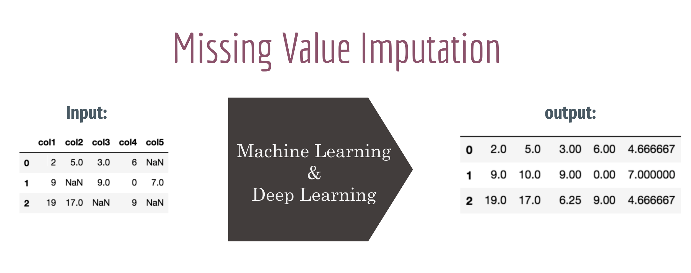
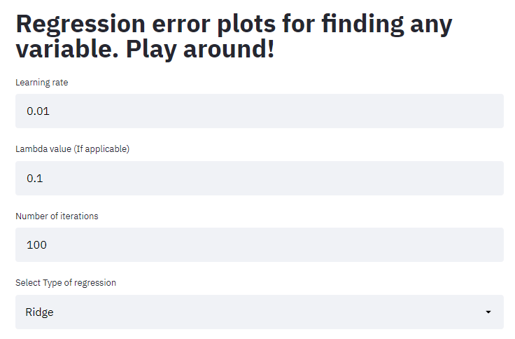
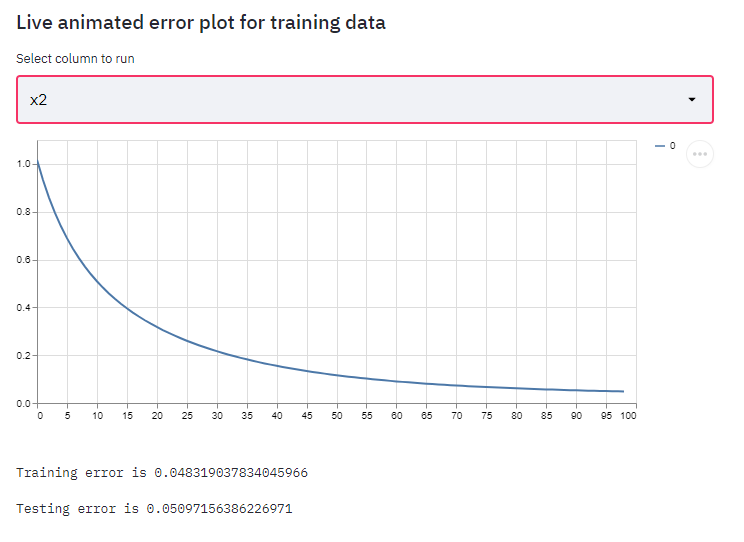
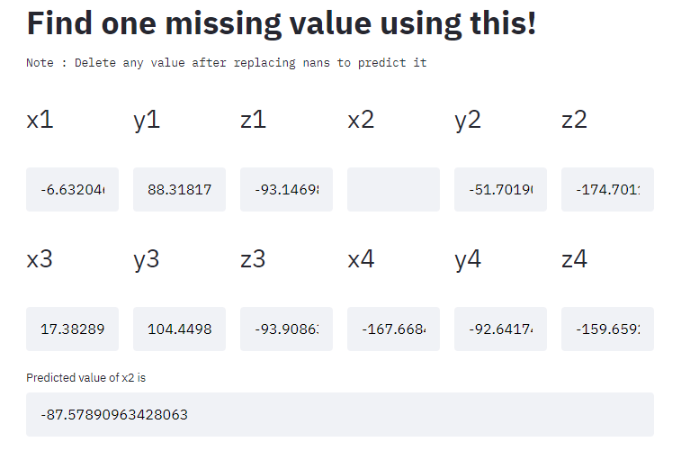
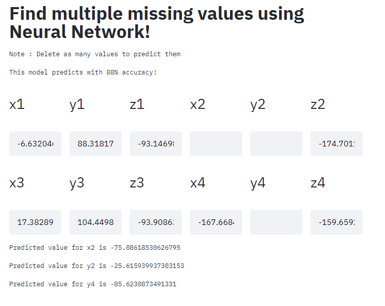

# Missing Feature Imputation through Machine Learning
- Many real-world datasets contains missing values for various reasons which often encoded as NaNs, blanks or any other placeholders. Training a model with a dataset that has a lot of missing values can drastically impact the machine learning model’s quality.
- In this project, we handle this problem statement using different Regression Models from scratch. 
- We have also designed a Deep Neural Network that can imputation all the missing values of a sample datapoint at once, with a fascinating score of 0.15 where 0 is the best and 1 is the worst.
- We have also built a Streamlit Web Application that can impute missing values given the datapoint with missing values. One of the main reasons, we built this applicaiton with a thought that true power of any technology is said to be utilized when an end-user can successfully use it as a black-box.
- Below we sub-divided the puedoCode for regression model and Multi-Feature imputation model using a Deep Neural Network.

# Contributions:
@aravind-reddy-dandu and @Harsha-Musunuri worked on the entire repository. At the time of this document, both are MSCS graduate students

# Core Logic
Apply different machine learning models learnt in the Class CS-536 Machine Learning at Rutgers University to impute the missing values of the given dataset

# Psuedocode for Regression Models
1. Train regression models with Missing Value Columns as Traget Columns
2. Use the trained models to imput the Missing Values using the remaining features of the TestData
3. Compare the Actual Values of the predicted values and calculate the MSE between to understand Accuracy.

# Psuedocode for Multi-Feature imputation using Neural Network
- We are using a Deep Neural Network which learns to impute all the features from X1 through Z4 (accelerometer readings in our dataset).
- We are training the Neural Network by passing X1 through Z4 (say, m samples) with few feature values being missed and the missed values are filled as mean of the column as the input.
- One of the main reason to fill in mean values for missing values in the input stage for NN is to make it build a relation between the true value and mean value. - We tried an experiment with zero as the replace value for missing data but as it would be same for every missing value, it is just tough for the neural net to 6. make a relation between all zeros and individual true values and as expected the results were not that great.
- The results are pretty fascinating when we used mean as the replace value.
- The cost function is between the True Values of X1 through Z4 and the True values , mean of X1 through Z4 as explained above. For instance, Let's say we have 3 features a,b,c and for one sample if the feature 'a' has missing value, we fill that the amean and compute <strong>Cost</strong> ((amean,b,c),(atrue,b,c).
- We train the NN to minimise the cost.

# StreamLit Application

This web application uses Regression and Neural networks to visualize and impute missing values and the training process.
## Regression error plots

We have given text boxes to input different parameters of regression. Another text box is to select the feature to be imputed. Changing each parameters, we can find the best set of parameters for each feature. Below is the interface for this.

    
 
 
 

  
  

  
## Single feature imputation using Regression

  

Here we impute one value when all the other are given. This is done by regression.

## Multi-feature imputation- Neural networks

  

As discussed above, multiple-features can be imputed here. This is using neural networks.
